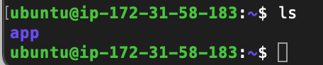
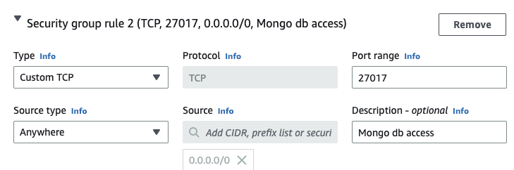

# 2 tier architecture deployment on aws

### Secure copying app folder to EC2 instance

1. After creating and setting up your EC2 on AWS. Open 2 bash windows and ssh into the instance on one of them. Then update, upgrade and install nginx on this instance.


```
sudo apt update -y

sudo apt upgrade -y

sudo apt install nginx
```

2. To secure copy the app folder to this instance, within the second bash terminal, cd into your secure shell key folder with:

```
cd .shh
```

Now we need to input this command to copy the app folder:

```
scp -i "tech221.pem" -r /Users/reispinnock/Documents/SpartaGlobal/tech221_virtualisation/app ubuntu@ec2-34-252-177-22.eu-west-1.compute.amazonaws.com:~/.
```

- `-i` - specifies the private key file to use for authentication

- `-r` - specifies the app folder should be copied recursively (i.e. includes all subdirectories and files).

You can confirm this has worked by going back to the instance you have ssh'd into as using `ls` to check the files in this instance you should see the app folder 



### Deploying app through EC2 instance

1. Install Required dependincies, we need to install the relevant nodejs packages aswell as npm and pm2 with.

```
sudo apt-get install python-software-properties

curl -sL https://deb.nodesource.com/setup_12.x | sudo -E bash

sudo apt-get install -y nodejs

sudo npm install pm2 -g
```

2. We need to Ensure Security Gate allows port 3000

<br>

3. Then we need to `npm install` from app folder location and then we can `npm start`

```
npm install

npm start
```

Copying the IP address of our instance from the AWS website to our browser with ':3000' at the end our app should be deployed. 

### Setting up Reverse Proxy on EC2 instance

1. First we need to disable the defualt virtual host:

```
sudo unlink /etc/nginx/sites-enabled/default
```

2. We then need to change directorys 

```
cd /etc/nginx/sites-available/
```

3. Create a new configeration file 

```
sudo nano reverse-proxy.conf
```

and within that file we need to write

```
server {
    listen 80;
    location / {
        proxy_pass http://<IP_of_app>:3000/;
       }
     } 
```

4. Now we can activate the directory with

```
sudo ln -s /etc/nginx/sites-available/reverse-proxy.conf /etc/nginx/sites-enabled/reverse-proxy.conf
```

5. Test our nginx configeration 

```
sudo service nginx configtest
```

and restart the server

```
service nginx restart
```

Now running the app as usual and removing ':3000' should load the app on our web browser. 

## Creating an EC2 instance for MongoDB

1. We need to set up a new EC2 instance with Ubuntu 18.04!

<br>

2. Change Security Groups:
 
 - Add SSH connection with "MyIP"
 - Custom TCP connection with port `27017`
 - Custom TCP connection with port `3000`

 

3. Launch the Instance and SSH into it as usual. 

4. In a seperate Bash Terminal we need to securely copy over our mongoDB script 

```
scp -i "tech221.pem" /Users/reispinnock/Documents/SpartaGlobal/tech221_virtualisation/environment/provision-mongodb.sh ubuntu@ec2-34-244-25-119.eu-west-1.compute.amazonaws.com:~/.
```

Once copied over we need to change permissions with

```
sudo chmod +x provision-mongodb.sh
```

and we can run this with

```
./provision-mongodb.sh
```

## Connecting our 2 EC2 instances 

We now have two windows one SSH'd into our app and the other our db. we first need to work in the db instance. 

1. We need to access the `BindIP` of our db and change it to `0.0.0.0`.

```
sudo nano /etc/mongod.conf
```

save these with `CRTL + X`, `Y` and `Enter`.

2. We then need to restart and enable mongo

```
sudo systemctl restart mongod

sudo systemctl enable mongod
```
Moving to our app instance

1. We now need to create a persistant environment varialbe to be able to connect the database to our app.

```
sudo nano .bashrc
```

At the bottom of the file add our variable 

```
export DB_HOST=mongodb://<our_db_ip>:27017/posts
```

save these with `CRTL + X`, `Y` and `Enter`.

2. We need to save these changes 

```
source .bashrc
```

3. change directory to be within our app, install `npm` and then seed our db.

```
cd app

npm install

node seeds/seed.js
```

4. Start the app in the background. 

```
node app.js &
```

5. Use your browser to navigate to you posts page with  

```
<IP_of_app>/posts 
```


!! IMPORTANT !!

- `lsof -i tcp:3000` & `kill -9 PID` - to kill a process using port 3000.

